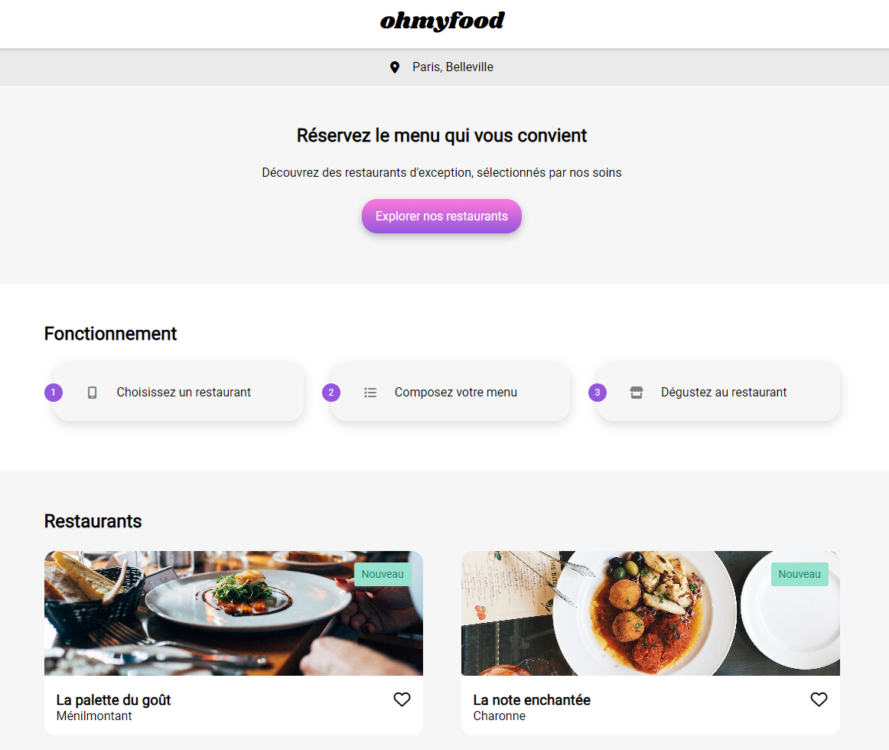

# ohmyfood


Projet 3 du parcours "**Développeur d'application - JavaScript React**" chez [OpenClassroom](https://openclassrooms.com/fr/).

Dynamisez une page web avec des animations CSS



# Description

Vous avez intégré Ohmyfood en tant que développeur junior. Il s’agit d’une jeune startup qui voudrait s'imposer sur le marché de la restauration. Déjà présente à New-York, elle souhaite désormais faire sa place à Paris.

# Objectifs

- Intégrer une maquette (depuis Figma),
- Dynamiser une page web avec des animations en CSS.

## Marque

### Identité

Ohmyfood est une entreprise de commande de repas en ligne. Notre concept permet aux
utilisateurs de composer leur propre menu et de réduire leur temps d’attente dans les
restaurants, car leur menu est préparé à l’avance. Plus de perte de temps à consulter la
carte !

### Proposition

Nous souhaitons proposer à nos clients les menus de restaurants gastronomiques. Après
l’avoir développé à New-York dans un premier temps, nous souhaitons désormais élargir
notre concept à la capitale de la gastronomie : Paris.

### Positionnement

Nous nous positionnons sur un marché de niche, avec les restaurants luxueux des villes
dans lesquelles nous sommes établis. Nous souhaitons être identifiés comme une
entreprise proposant des services haut de gamme.

## Problématique

Nous souhaitons ouvrir nos services à la capitale française.

### Objectifs

- Phase 1 : Développer un site proposant le menu de 4 grands restaurants parisiens.
- Phase 2 : Permettre la réservation en ligne et la composition de menus.

## Identité graphique

### Polices

- _Shrikhand_ pour le **logo** et les **titres**.
- _Roboto_ pour le **_texte_**.

### Couleurs

- **Primaire**: #9356dc
- **Secondaire**: #ff79da
- **Tertiaire**: #99e2d0

## Technologies

- Le développement doit se faire en CSS, sans JavaScript.
- Le code CSS doit être disponible dans un ou plusieurs fichiers dédiés.
- Le site devra être réalisé en adoptant le Mobile First, c’est-à-dire qu’il faudra d’abord
  réaliser l'intégration de la maquette mobile, puis tablette, et enfin l'intégration du
  responsive vers le desktop.
- Aucun framework ne devra être utilisé ; en revanche l’utilisation de SASS serait un
  plus.
- Aucun code CSS ne doit être appliqué via un attribut style dans une balise HTML.
- Tout le code doit être versionné sur GitHub avec des commits réguliers pour
  suivre l’avancement et publier le site en ligne plus facilement.
- Le site devra être accessible sur GitHub Pages une fois terminé.

## Compatibilité

La cible étant les personnes connectées et pressées, le site sera développé en utilisant
l’approche mobile-first.
Le site devra donc être intégré en suivant les maquettes mobile, puis le responsive suivra
pour les tablettes et ordinateurs en suivant les maquettes ordinateur données par notre
designer.

- L’ensemble du site devra être responsive sur mobile, tablette et desktop.
- Les pages devront passer la validation W3C en HTML et CSS sans erreur.
- Le site doit être parfaitement compatible avec les dernières versions desktop de
  Chrome et Firefox.

## Contenu des pages

### Page d'accueil (x1)

- Affichage de la localisation des restaurants. À terme, il sera possible de choisir sa
  localisation pour trouver des restaurants proches d’un certain lieu.
- Une courte présentation de l’entreprise.
- Une section contenant les 4 menus sous forme de cartes. Au clic sur la carte,
  l’utilisateur est redirigé vers la page du menu.

### Pages des menus (x4)

- 4 pages contenant chacune le menu d’un restaurant.

### Footer

- Le footer est identique sur toutes les pages.
- Au clic sur "Contact", un renvoi vers une adresse mail est effectué.

### Header

- Le header est présent sur toutes les pages.
- Sur la page d'accueil, il contient le logo du site.
- Sur les pages de menu, il contient en plus un bouton de retour vers la page d'accueil

## Effets graphiques et animations

Les effets accessibles au clic ou au survol sont visibles sur la maquette. Ils devront utiliser
les animations ou transitions CSS, pas de JavaScript ni de librairie. Pour toutes les
animations, afin de soigner le rendu du site, il est important que lorsque nous avons un effet
au hover ou lors d’un clic, nous ayons l’effet inverse lorsque l’on quitte le survol.

### Boutons

- Au survol, la couleur de fond des boutons principaux devra légèrement s’éclaircir.
  L’ombre portée devra également être plus visible.
- À terme, les visiteurs pourront sauvegarder leurs menus préférés. Pour ça, un
  bouton "J’aime" en forme de cœur est présent sur la maquette. Au clic, il devra se
  remplir progressivement. Pour cette première version, l’effet peut apparaître au
  survol sur desktop au lieu du clic.

### Page d’accueil

- Quand l’application aura plus de menus, un “loader” sera nécessaire. Sur cette
  maquette, nous souhaitons en avoir un aperçu. Il devra apparaître pendant 1 à 3
  secondes quand on arrive sur la page d'accueil, couvrir l'intégralité de l'écran, et
  utiliser les animations CSS. Le design de ce loader n’est pas défini, toute proposition
  est donc la bienvenue tant qu’elle est cohérente avec la charte graphique du site.

### Pages de menu

- À l’arrivée sur la page, les plats devront apparaître progressivement avec un léger
  décalage dans le temps. Ils pourront apparaître soit un par un, soit par groupe
  “Entrée”, “Plat” et “Dessert”.
- Le visiteur peut ajouter les plats qu'il souhaite à sa commande en cliquant dessus.
  Cela fait apparaître une petite coche à droite du plat. Cette coche devra coulisser de
  la droite vers la gauche. Pour cette première version, l’effet peut apparaître au survol
  sur desktop au lieu du clic. Si l’intitulé du plat est trop long, il devra être rogné avec
  des points de suspension.

## Tester le projet

Pour tester simplement et rapidement : [https://code9g.github.io/ohmyfood/](https://code9g.github.io/ohmyfood/)

Sinon, clonez le projet

```terminal
git clone https://github.com/code9g/ohmyfood.git
```

Et lancez la page

```terminal
index.html
```

[](<[http://](https://github.com/code9g/)>)
[](https://www.linkedin.com/in/pierre-andre-henry/)
